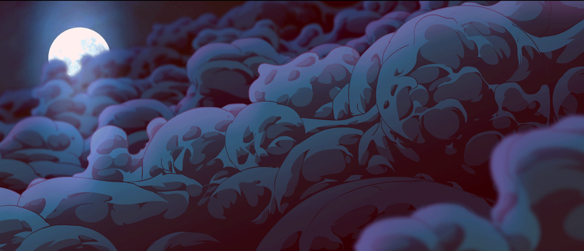
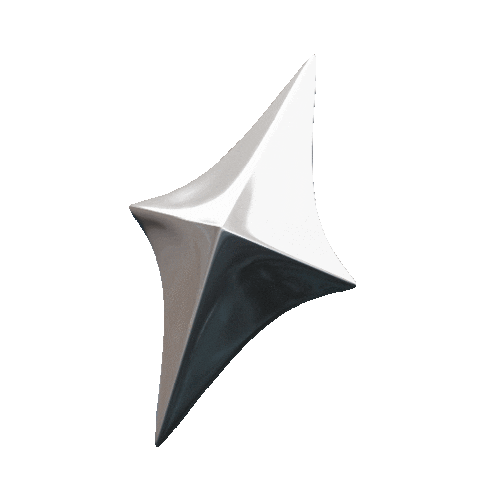

  <!-- ═══ HEADER BANNER ══════════════════════════════════════════ -->
  

  
  <!-- ═══ NAME TYPING ANIMATION ══════════════════════════════════ -->
  <!-- <picture>
    <source media="(prefers-color-scheme: dark)"
      srcset="https://readme-typing-svg.demolab.com?font=Geist+Mono&weight=600&size=38&duration=3000&pause=1000&color=9D7CD8&center=true&vCenter=true&width=600&lines=Utkarsh+Jaiswal;Zyaxxy;Web3+%26+Full-Stack+Dev" />
    <source media="(prefers-color-scheme: light)"
      srcset="https://readme-typing-svg.demolab.com?font=Geist+Mono&weight=600&size=38&duration=3000&pause=1000&color=6B46C1&center=true&vCenter=true&width=600&lines=Utkarsh+Jaiswal;Zyaxxy;Web3+%26+Full-Stack+Dev" />
    
  </picture> -->

   

  <!-- ═══ SUBTITLE TYPING ANIMATION ══════════════════════════════ -->
  <!-- <picture>
    <source media="(prefers-color-scheme: dark)"
      srcset="https://readme-typing-svg.demolab.com?font=Geist+Mono&weight=500&size=16&duration=2000&pause=1000&color=BB9AF7&center=true&vCenter=true&width=600&lines=Blockchain+%26+Full-Stack+Developer;Solana+%C2%B7+Rust+%C2%B7+React+%C2%B7+Node.js;Building+Scalable+%26+Impactful+Solutions" />
    <source media="(prefers-color-scheme: light)"
      srcset="https://readme-typing-svg.demolab.com?font=Geist+Mono&weight=500&size=16&duration=2000&pause=1000&color=555555&center=true&vCenter=true&width=600&lines=Blockchain+%26+Full-Stack+Developer;Solana+%C2%B7+Rust+%C2%B7+React+%C2%B7+Node.js;Building+Scalable+%26+Impactful+Solutions" />
    
  </picture> -->

   

  <!-- ═══ SOCIAL ICONS ═══════════════════════════════════════════ -->
  

    
    &nbsp;
    
    &nbsp;
    
  

  <!-- ═══ DIVIDER ════════════════════════════════════════════════ -->
  <picture>
    <source media="(prefers-color-scheme: dark)"  srcset="https://capsule-render.vercel.app/api?type=rect&height=2&color=FFFFFF" />
    <source media="(prefers-color-scheme: light)" srcset="https://capsule-render.vercel.app/api?type=rect&height=2&color=6B46C1" />
    
  </picture>
  

 

<!-- ═══ AUTOMATED STATS & METRICS ═════════════════════════════════ -->

  

<table border="0" width="100%">
  <tr border="none">
    <td valign="top" align="left">
        
      
        
      
        
      
        
    </td>
    <td valign="top" align="center" width="420px">
      
        
      

        
        
      

    </td>
  </tr>
</table>

 

---

<!-- ═══ TECH STACK ═════════════════════════════════════════════════ -->
<h2 align="center"> Languages & Technologies</h2>
 

<table align="center">
  <!-- Languages -->
  <tr>
    <td align="center" width="96">
       
      <b>Rust</b>
    </td>
    <td align="center" width="96">
       
      <b>JavaScript</b>
    </td>
    <td align="center" width="96">
       
      <b>TypeScript</b>
    </td>
    <td align="center" width="96">
       
      <b>Python</b>
    </td>
    <td align="center" width="96">
       
      <b>C++</b>
    </td>
    <td align="center" width="96">
       
      <b>C</b>
    </td>
    <td align="center" width="96">
       
      <b>Solidity</b>
    </td>
  </tr>

  <!-- Frameworks & Libraries -->
  <tr>
    <td align="center" width="96">
       
      <b>React</b>
    </td>
    <td align="center" width="96">
       
      <b>Next.js</b>
    </td>
    <td align="center" width="96">
       
      <b>Tailwind</b>
    </td>
    <td align="center" width="96">
       
      <b>Node.js</b>
    </td>
    <td align="center" width="96">
       
      <b>Express</b>
    </td>
    <td align="center" width="96">
       
      <b>MongoDB</b>
    </td>
    <td align="center" width="96">
       
      <b>PostgreSQL</b>
    </td>
  </tr>

  <!-- DevOps & Tools -->
  <tr>
    <td align="center" width="96">
       
      <b>Git</b>
    </td>
    <td align="center" width="96">
       
      <b>GitHub</b>
    </td>
    <td align="center" width="96">
       
      <b>Docker</b>
    </td>
    <td align="center" width="96">
       
      <b>Linux</b>
    </td>
    <td align="center" width="96">
       
      <b>Bash</b>
    </td>
    <td align="center" width="96">
       
      <b>VS Code</b>
    </td>
    <td align="center" width="96">
       
      <b>Postman</b>
    </td>
  </tr>
</table>

 

---

---

<!-- ═══ FOOTER ═════════════════════════════════════════════════════ -->

  Made by <a href="https://github.com/Zyaxxy"><b>Utkarsh Jaiswal</b></a>

  

